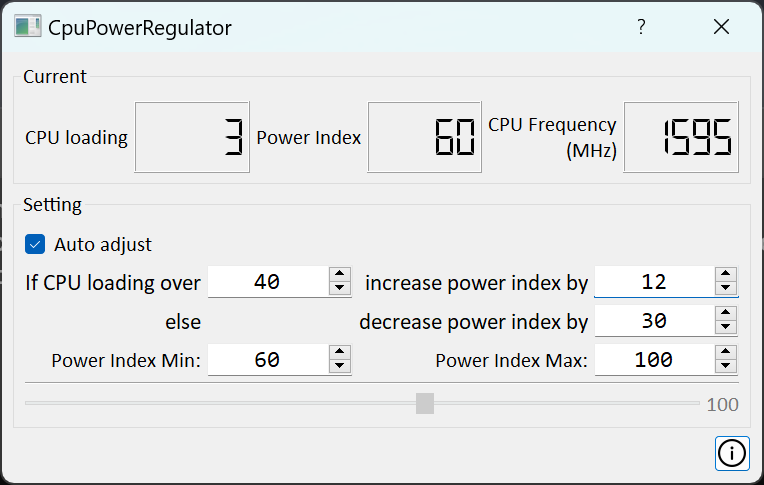

<table border="0">
    <tr>
        <td></td>
        <td></td>
    </tr>
</table>

## Introduction:

Welcome to CpuPowerRegulator, CpuPowerRegulator is a Windows application that brings intelligence to your CPU performance management. Offering dynamic adjustments to the "Maximum Processor State" based on real-time CPU loading.

## Key Features:

1. Set a custom threshold for CPU loading, and let the application intelligently respond. If the CPU load surpasses the defined threshold, CpuPowerRegulator dynamically increases the "Maximum Processor State" to ensure optimal performance. Conversely, when the load drops below the threshold, the application intuitively decreases the processor state, conserving power and enhancing efficiency.

2. Fine-Tuned Increment and Decrement Steps: Take precise control over performance adjustments with customizable increase and decrease steps. Tailor the application to respond with granularity, allowing you to strike the perfect balance between performance and energy efficiency. Whether you prefer subtle changes or more aggressive responses, CpuPowerRegulator puts you in the driver's seat.

3. Manual control. Whether you have specific preferences for different tasks or simply want to take charge of your system's performance, CpuPowerRegulator empowers you to make instant adjustments according to your unique requirements.

## How to Use:

1. Set a CPU loading threshold that aligns with your performance expectations.
2. Customize Increment and Decrement Steps.
3. Let it run at background.
